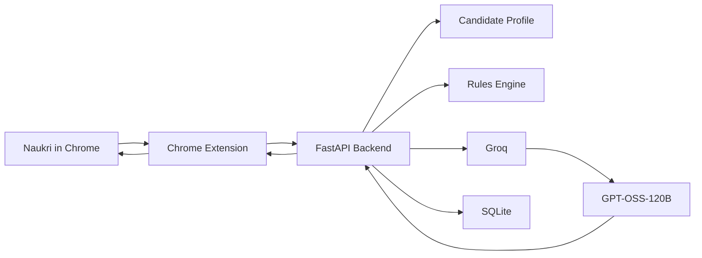

# Naukri AI Job Assistant

Multi-user Chrome MV3 extension that reads jobs already rendered in a user's normal Naukri session, sends normalized job data to an authenticated FastAPI backend, and displays conservative Groq/GPT-OSS analysis beside each card.

It does not scrape Naukri with a separate browser, read cookies, bypass CAPTCHA/OTP/MFA, evade anti-bot controls, or submit the final application button.



## What is implemented

- MV3 extension with automatic page detection, debounced `MutationObserver` scanning, DOM-card deduplication, normalized job import, and in-page match badges.
- Per-user Naukri AI accounts, profiles, preferences, job history, analyses, and applications. One user's results never appear in another user's dashboard.
- Deterministic seniority/experience filtering before Groq calls.
- Groq structured analysis using `openai/gpt-oss-120b`, retries, validation, and persisted SQLite results.
- Full visible job-detail extraction with cached analysis.
- Application-form detection, verified profile-field autofill, question classification, and manual fallback for sensitive/unknown questions.
- Application tracking endpoints for prepared/applied states. V1 never clicks Naukri's final submit button.

## Setup

```powershell
Copy-Item .env.example .env
cd backend; python -m venv .venv; .\.venv\Scripts\Activate.ps1; pip install -r requirements.txt
cd ..\extension; npm install; npm run build
```

Set `GROQ_API_KEY` only in the backend `.env`. On first use, create a Naukri AI account in the extension panel, then fill only verified facts in that account's profile. The legacy YAML files are not used for authenticated users.

For public deployment, use a transactional sender such as Resend. Add these backend-only values to `.env` (never to the extension):

```text
RESEND_API_KEY=re_your_server_only_resend_key
EMAIL_FROM=Naukri AI <noreply@your-verified-domain.com>
```

Each reset email is sent to the requesting user dynamically. The Gmail App Password variables remain available only as a local-development fallback.

```powershell
The initial account profile is intentionally empty. Never put one user's facts in shared backend configuration.
```

Start the API from the repository root:

```powershell
python -m uvicorn app.main:app --app-dir backend --host 127.0.0.1 --port 8001 --reload
```

The health check is `http://localhost:8001/api/health`. The API returns whether Groq is configured, but never returns the key.

## Load the extension in Chrome

After every source change, rebuild with `cd extension; npm run build`. Open `chrome://extensions`, enable **Developer mode**, click **Load unpacked**, and select the `extension/dist` folder. If it was already loaded, click the extension's **Reload** button after rebuilding.

Open Naukri in the same Chrome profile where you normally log in. Search normally; the extension observes jobs that Naukri has actually rendered. Open the extension panel, create/sign in to your Naukri AI account, and complete its profile. The backend URL defaults to `http://localhost:8001`; a hosted backend must use HTTPS and Chrome asks permission for its domain when you save it.

## Core flow

```text
Rendered Naukri card -> extension extraction -> hard filters -> FastAPI import
-> cached/structured Groq analysis -> badge beside the original card
```

Only relevant, new jobs are sent to the model. Existing jobs retain their stored analysis. On a job-detail page the visible description is sent for deeper analysis only once. The extension never reads cookies, passwords, or session tokens.

## Application assistant

When a Naukri application form is visible, the extension identifies inputs and labels. With **Auto Fill** enabled it fills only recognized factual or preference fields from `candidate_profile.yaml`, marks those inputs with `data-naukri-ai-filled`, and leaves descriptive, sensitive, and unknown questions alone. The backend can classify a question and generate a concise descriptive answer using only profile facts and projects.

Review every field and use Naukri's own Submit/Apply button. OTP, CAPTCHA, MFA, access-denial, authorization, and other security-sensitive steps always require manual action.

## API

Important routes are:

```text
GET  /api/health
POST /api/auth/register
POST /api/auth/login
POST /api/auth/forgot-password
POST /api/auth/reset-password
GET  /api/auth/me
POST /api/jobs/import
GET  /api/jobs
GET  /api/jobs/{id}
POST /api/jobs/analyze
POST /api/jobs/analyze-batch
POST /api/screening/classify
POST /api/screening/answer
GET  /api/profile
POST /api/applications/{job_id}/prepared
POST /api/applications/{job_id}/applied
GET  /api/stats
```

## Docker

For a containerized backend with persistent SQLite storage:

```powershell
Copy-Item .env.example .env
docker compose up --build
```

The backend image is based on Python 3.12-slim. For production, set `DATABASE_URL` to PostgreSQL and put the API behind HTTPS. The extension remains a separately built static Chrome artifact.

## Testing

```powershell
cd backend
python -m compileall -q app
pytest -q
cd ..\extension
npm run build
```

The normal tests do not require live Naukri or a Groq key. Current live Naukri selectors are intentionally not claimed as validated against an unseen browser session. If a current Naukri layout is not detected, enable **Debug mode**, open the page DevTools console, and provide the `[NaukriAI]` counts plus a sanitized DOM snippet for the affected card. Do not provide cookies, tokens, or personal data.

## Safety and maintenance

CAPTCHA, OTP, MFA, access denial, unknown questions, and sensitive declarations stop automation and require the user. Final submission remains user-controlled. Naukri DOM changes are isolated to `extension/src/content/selectors.ts`; use extension debug mode to inspect counts without logging private data.

## Security and limitations

The Groq key and database remain server-side; no key is bundled into the extension. The extension stores only its opaque Naukri AI bearer token locally in the Chrome profile. It never reads Naukri cookies, passwords, or session tokens. For production, use PostgreSQL, set a narrow `CORS_ORIGINS` allow-list, require HTTPS, and put the API behind a secure reverse proxy. The included password login is a starter authentication layer; add email verification, password reset, rate limits, token expiry/revocation, and audited migrations before a public launch.

Naukri may change its DOM or require a security verification. The extension only processes rendered content in the normal logged-in browser tab; it is not a cloud crawler and cannot reliably fetch jobs from a blocked or non-rendered page. The server does not use Playwright or attempt to bypass access controls.

## Development roadmap

The next validation step is real-browser DOM inspection across search results, job details, applications, screening questions, and success confirmation. After that, selectors can be adjusted from observed sanitized markup, and richer popup statistics/history can be added without changing the safety boundary.
